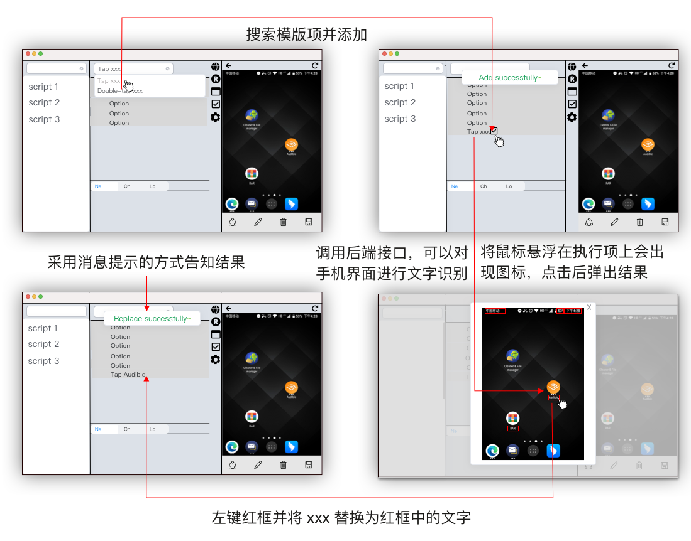
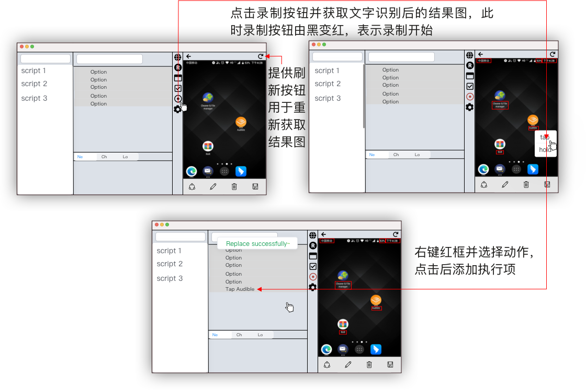
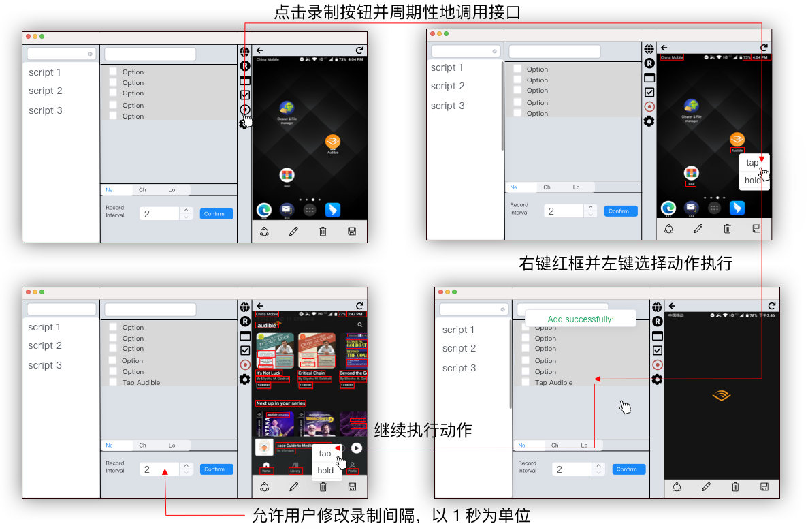

# 总述

Manis是一个基于自然语言的 UI 自动化测试平台，测试工程师利用该平台对各大平台的网页及软件的 UI 进行测试，以此来保证 UI 的交互以及功能是正常的。
在实习期间，我开发了一个 OCR 相关的功能，来帮助测试工程师更便携地编写测试脚本。

# 迭代 1.0 - 小 Demo

在我接手这个功能的开发任务时，其实已经进行了一部分，产品经理给我演示了之前做的一个功能。在设备连接到电脑之后，利用该功能，测试工程师可以在 OCR 的结果图上选取文字来替换模版占位符。

 图1 文字替换交互图 

当测试工程师需要输入大量字符来替换模版占位符时，这项功能就非常好用。

当然，此时离最终要开发的功能还差很多，但通过开发一个个小 demo，在获得成就感的同时，能够更好地让产品经理把握开发进度。

在调试的过程中我自己感觉到，其实使用模态框并不是比较好的解决方案，主要原因有两点：
1. 弹出的界面和原先的界面并不在同一层，这样用户无法同时操作原先界面的东西,同时打断了用户操作的节奏。
2. 即便采用了透明背景色，仍然有较大区域被遮挡，用户无法看到原先界面的样子，进而失去了一部分“视野”。

## 
 在一定场景下，模态框带来的用户体验并不好

产品经理其实很早就想到了这点他只是在慢慢地引导我慢慢地朝着目标功能一步一步开发。
目前来说，替换文字需要至少三步：
1. 添加模版执行项
2. 点击按钮获得结果图
3. 点击需要替换的字符

那么，我们该如何减少步骤呢？

# 迭代 2.0 - 整合

在开发过程中，我发现弹出的结果图和右边的手机预览模块其实很类似，只是结果图中多了一些红框。我把我的发现告诉了产品经理，他笑了笑，问我可不可以把他们整合在一起。
就在侧边按钮栏上新加一个按钮，取名为“录制”。点击“录制”后，使用结果图替代原先的预览模块。因为考虑到后续会有多种操作，产品经理让我把左键红框改成了右键，并提供多种选项。

 图2 初版录制功能交互图 

目前看来，添加一个执行项的步骤如下：
1. 点击录制按钮
2. 右键红框并点击对应动作

在上一版的基础上，这一版我们并不需要添加模版执行项了，而且因为将结果图和预览模块整合在了同一个功能区里，这样更方便用户来操作。

但是，这一版中我们并没有考虑到执行动作以及连续添加这两个问题：
1. 当你点击相应动作后，并不会真的在手机上执行该命令
2. 由于结果图是截图的形式，如果要跳到其他界面还需要点击停止录制并在预览模块中点选软件，再录制新的界面。

## 
 用户体验应该具有连续性

换言之，我们还需要进一步整合，将预览模块中的点选功能加到录制中。然而，在一步上我们遇到了麻烦。

# 迭代 3.0 - 连续的用户体验

由于该功能是面向全平台的，我们必须考虑到每一个平台的设备。对于安卓和苹果设备，在和后端的沟通中得知，执行动作都是由他们来实现，我只需调用特定接口就行。
但麻烦出在 PC 端。在我们打开电脑端上的软件并开启录制后，需要我们通过控制鼠标来执行点击红框中的内容。如果需要精确地移动鼠标到特定位置，这就必须要通过程序实现。
在与产品经理和后端的沟通中我得知，这件事后端可以来实现，但不知道前端是否可以通过代码来控制鼠标。为了测试这种可行性，我进行了技术预研和概念验证。

## 技术预研及概念验证

在网上搜索后，我发现了 RobotJS 这个 GUI 自动化工具，通过调用这个库的 api 可以在前端控制鼠标来执行相应动作。
然而就在我安装这个库的过程中，我发现需要编译一些 C 语言的模块。网上搜寻一番得知，需要安装 Visual Studio 这个软件，并且在 Node.js 中指明软件版本号才能安装。
得知这一消息后，我并没有先告诉产品经理和后端，而是先验证安装 Visual Studio 后是否真的能正确安装并控制鼠标。在安装并验证通过之后，我将这一结果演示给了产品经理和后端。
目前看来，前端确实可以控制鼠标。但一项决策的形成往往有多种因素。

在汇报的时候，我特意提到了需要安装 Visual Studio 这个软件才能正常运行时，他们皱起了眉头。这是为什么呢？
原来我在开发的时候，只考虑了本地的部署，而如果需要部署到服务器上，那就需要考量更多。
如果本地需要安装该软件，那么意味着服务器上也需要安装，而且未来如果进行项目的迁移，新的服务器也要安装这个软件。而这个软件需要好几个 GB，且安装较为繁琐，无形之中加重了人力资源的使用。
权衡之下，我们还是决定让后端来做这个功能。

## 
 做出决策之前必须要验证可行性

在连续录制方面，我们发现了一个常见的问题 - 在跳转到新的页面时，我们无法知道新的页面何时会出来，那么红框的生成时间也就无法确定。
经过讨论，我们决定通过周期性地调用文字识别的接口来解决该问题，这样的话定时调用接口，就会自动生成红框。
同时，我们还允许用户能够自由调节录制间隔。然而，就在这问题上，我与产品经理和后端产生了一些纠纷

### 小纠纷

我在测试的时候发现，如果录制间隔调成 0.1 秒，也就是每 0.1 秒调用该接口，那么呈现的效果会非常好。即使跳转到新页面，后框也会随时生成。
我把效果给产品经理看的时候，他也觉得很好。但当我给后端看的时候，他说虽然效果很好，但考虑到这个平台还是有很多人用的，如果有许多人同时开启该录制功能，那么每秒就会调用几百次这个接口，这样的话服务器资源占用率过高可能会导致奔溃。
因而，最终我们商议录制间隔最小只能调整为 1 秒，并且是以 1 秒为单位来进行调整。

## 
 我们需要在产品目标和现有资源之间做权衡

至此，录制功能大体开发完毕。产品经理跟我说他们会在我开发的这个功能上做改进。

 图3 连续录制功能交互图 

当测试工程师需要添加执行项时，步骤为：
1. 点击录制按钮
2. 右键红框并左键执行相应动作
3. 等待页面跳转且有新的红框出现，再次操作