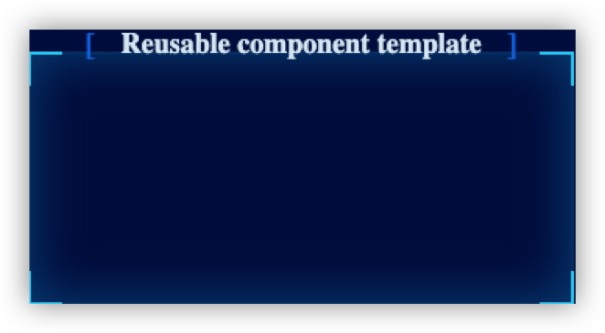
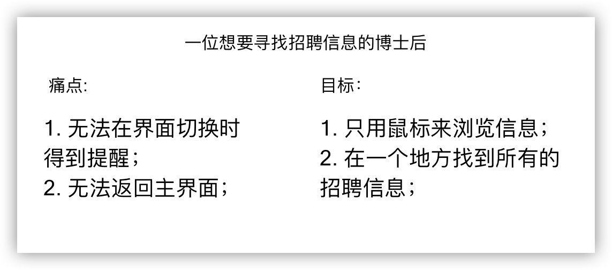

# 问题

在项目初期，客户给到我们一张图，需要给浙江博士后的官网做一个类似该图的数据可视化平台。
除此之外，客户还给到我们一个 json 文件，其中包含了需要我们用可视化技术呈现出来的数据。
但具体要怎么呈现，客户并没有细说，需要我们自己去琢磨。

 图1 客户给的示意图 

## 
 有时用户并不知道他们想要什么

所以，在我们没有得到明确客户需求的前提下，我们是如何开发出最终的网站？我们必须找到真正的需求以及适用的技术栈。

# 版本 0.1 - Demo

首先，我先是在白板上画了一个大致的草图。左边呈现地图，右边呈现数据。我查看了 json 文件中的一些字段，
主要包含了地图、图表以及招聘信息这三种数据。随后我查看了浙江博士后的官网，发现官网中存在“招聘信息”及“博士后设站单位”这两个板块，是和 json 字段对应的。

 图2 infos 字段数据对应招聘信息板块 

 图3 maps 和 charts 字段数据对应设站单位列表板块 

我将调研的结果告诉了设计师，之后设计师给出了一个基本的网站原型图，左边是地图，右边上方是设站单位数据陈列板块，下方是招聘需求板块。

 图4 设计师给出的初版设计稿 

我们不难看出，招聘板块和设站单位列表都可以通过“城市”来进行分类，所以当我们点击地图上的一个城市时，其实可以动态地切换到该城市所对应的数据，
这也是该网站的核心交互之一。

从开发者的角度来看，在设计稿出来之后，我们需要去决定我们应该使用何种技术栈来实现。为了减小开发成本，我们应该在早期对技术栈进行预研，以此来找到较为满足客户需求的技术栈。

## 
 概念应该在早期进行验证

我和我的组员分别开发了一个 demo 来进行验证。我使用了 React.js 和 AntV, 我的组员使用了 Jquery + Echart。

由于 React 和 AntV 比较难上手且 Echarts 有较为丰富的社区图例，我们决定放弃 React + AntV 的选项。从开发难度来看， Jquery + Echart 并不难。

图5 初版Demo，链接 [http://nashi521.gitee.io/map-hz/](http://nashi521.gitee.io/map-hz/)

在客户看了这个 demo 之后，他们想要做出一些修改，例如添加额外的板块去可视化一些新的数据。那么，现在我们该怎么办？

 图6 客户给出的建议修改 

我们当然可以复制粘贴原有的代码，这样也比较方便。但如果客户在未来需要更多的板块呢？因为使用 Jquery 写出来的代码可复用性比较差，随着代码变得越渐复杂，可能需要耗费大量的时间来满足客户的需求。因而，我们决定更换技术栈，并且对网页进行重构。

# 版本 0.5 - 重构

如果我们需要以最少的精力来创建新的版本，甚至是以该网站的代码为基础来创建新的网站，我们需要让代码变得可复用起来。
经过调研以及老师的推荐，我们决定使用 Vue.js 和 Echart 来进行重构。

 图7 技术栈之间的对比图 

## 
 我们需要在用户需求和技术栈间不断地权衡

所以，为什么是 Vue ？如果你使用 Vue 搭建一个项目的 demo，你会发现 Vue 的脚手架工具已经帮助你创建一个基本的文件目录。在 components 文件夹中，你可以创建可复用的组件以及不可复用的组件。如果这个组件是可复用的，命名这个组件时可以在开头添加一个 “_”，例如 “_container.vue”。

 图8 使用 Vue 创建的文件目录 

在本项目中，一个常见的可复用组件如下图所示。这里有三个参数，分别是 iwidth，iheight 和 ititle，分别代表这个组件的长度、高度和标题。
在写这个组件的时候，我遵循了 “Data Down, Action Up” 的设计原则。数据只会从上层组件往下层组件流动，而事件则从下层组件往上层组件传递。

 图9 可复用组件示例 

当你在上层组件中调用该组件时，你可以像图中所示的一样输入三个参数。

 图10 上层组件调用下层组件 

此时网页中就会生成对应的组件。

 图11 网页中生成的组件 

目前我们开发了可复用的组件，这时就能更容易地创建新的板块了，只需要输入不同的参数对新的组件进行调整即可。
但是，又有新的麻烦出现了。

### 对接设计师时发生的小插曲

在早期的 demo 中，地图组件中添加了一个 “省站部署” 的小点。这是因为有些博士后工作站是省直属的，不属于任何城市。
在重构的时候，设计师提出来这个小点是否可以换成图标，这样显得更加直观。当时我没有多想，以为实现起来比较简单，就答应了。

但实际上手才发现，设计师所提供的图标并不能直接放到地图上，而是要通过 QGIS 这个专业软件在中国地图上绘制出相应的闭合图形，再导出获取该闭合图形对应的坐标数据，然后将坐标数据导入到绘制地图的 json 文件中才行。

 图12 使用 QGIS 绘制图标 

虽然只是一个小小的图标，但却花了我近一天的时间来实现，当时看来实现的效果还不错。

 图13 最终在网页上实现的效果 

值得反思的是，更换图标这件事我们并没有和客户及时沟通。所以在我实现完之后再去找客户汇报最新的进展时，客户说不需要这个图标，之前的小点就挺好的。
就这样，我花费了非常大的精力却做了无用功。这一方面是没有和客户及时沟通，另一方面我反思了和设计师对接时矛盾产生的根源。

## 
 为了说服工程师接受方案，设计师应该提供令人信服的数据

再说回解决客户提到的需求上来。为了添加新的板块，我们需要削减原油板块的长度。由于在招聘需求的字段信息各个不一，有的长有的短，如果削减招聘板块的长度，用户的浏览体验并不是很好。
而工作站的数据都是固定的，而且生成的图表也是固定的，所以我们决定只削减上方板块的长度。在大家都同意新的方案之后，设计师给出了新一版的设计稿。

 图14 第二版设计稿 

为了实现点击地图产生的交互，我和设计师讨论了很久。首先左边应该不动，而右方应该根据用户点击地图的区块作相应的变化。设计师没有告诉我具体的跳转应该怎么做，所以我只能在心中想象一个用户画像。

 图15 用户画像 

为了让用户能够直观地感受到页面的变化，我觉得决定在图表上加一点渐变动画。并且，由于用户无法回到主页，所以我在左上角添加了返回按钮。

 图16 最终交互方案 

## 
 看上去一切都挺好的，但真的是这样吗？

# 版本 1.0 - 从 0 到 1

在客户验收了最终的网站之后，他们给了我们另外一个 json 文件 并问我们能否为台州博士后的官网做一个类似的网页。从 0 到 1 构建一个网站并不容易，但这次不一样。

因为我们使用了较为合适的技术栈，并且写了许多可复用的组件，我们只需要将之前的组件做出样式上细微的变化，以及接上数据，这样就能在较短的时间内上线新的网站。我们大约花了半天时间。

图17 台州博士后官网，链接 [http://tzbsh.zjhwrc.com](http://tzbsh.zjhwrc.com)

